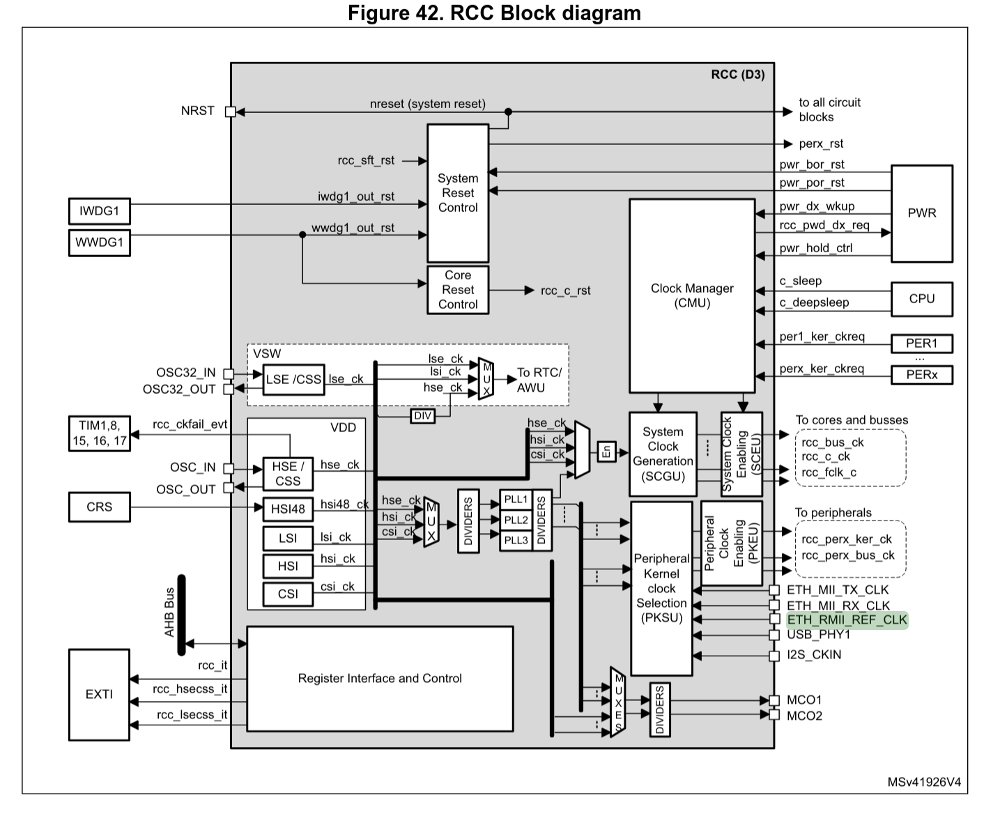
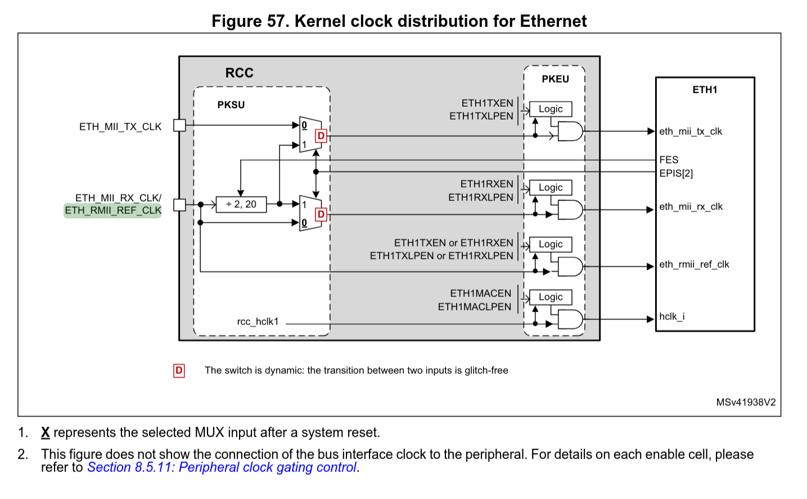
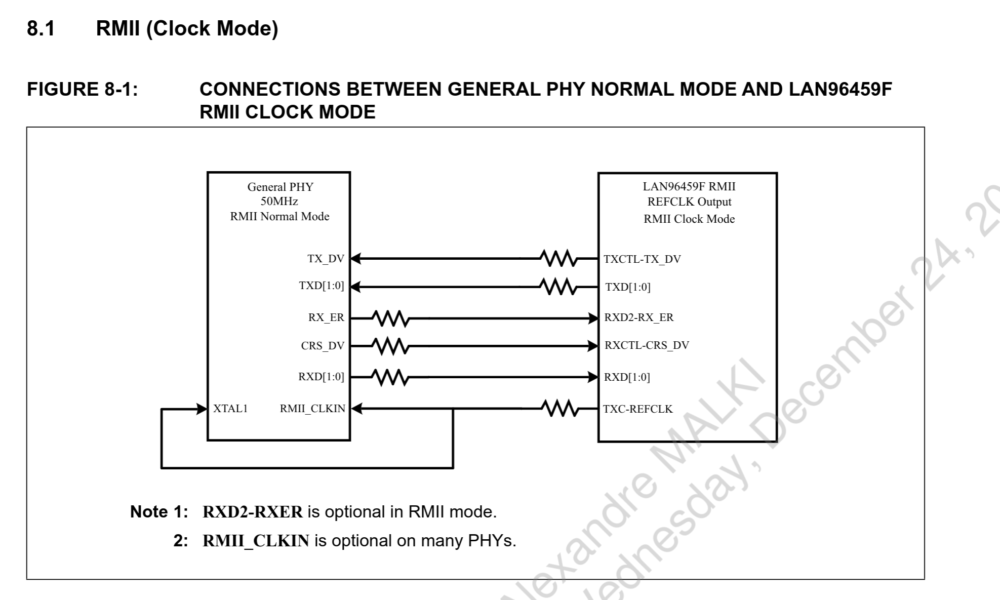

# Schematic Connections between LAN9645xF STM32H742

## Scope

This document intends to provide detailed information about the connection
between the Switch IC and the MCU. Not all functionality will be covered here,
only the most complicated and relevant ones.

## RMII

### Constraints

The RMII needs particular care to ensure correct behavior:

 * Routing - Impedance length matched
 * Routing - Termination Resitor close to the output buffer
 * Schematics - Add 22 Ohm is the length is below 50mm, just put 0R to verify
later

### Connections - Clocks

The STM32H7 has to get a RMII clock, below the Ethernet clock tree:

High level picture:

Closer to the Ethernet:

Connections between the switch and the LAN9645xF:

Signal that are used a documented into the STM32H742_LQFP100_Pinout, additional
function column
